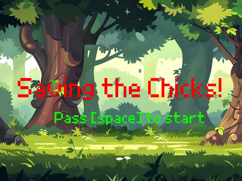
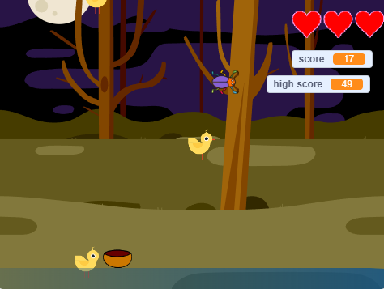
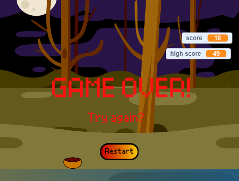

## Screenshots

### Screenshots

# Chicken Catch Game
A chicken-catching game created with Scratch.

## Game Description
- Use a bowl to catch falling chickens
- Avoid catching mice (they will reduce your lives)
- The higher the score, the faster the chickens fall
- Game ends when lives reach zero

## Game Features
- Dynamic difficulty adjustment
- High score record
- Visual effects (flashing, sound effects)
- Multi-character interaction

## How to Play
1. Download `chicken-catch-game.sb3`
2. Upload the file to [Scratch](https://scratch.mit.edu/) or play with this link: (https://scratch.mit.edu/projects/1202964709).
3. Press SPACE to start the game
4. Use LEFT/RIGHT arrow keys to move the bowl

## Technical Features
- Clone system
- Variable management
- Conditional logic
- Collision detection
- Sound system

## Author
KIU PO
---
# Chicken Catch Game
一個用 Scratch 製作的接雞遊戲。

## 遊戲說明
- 用碗接住掉下來的雞
- 避免接到老鼠（會扣生命）
- 分數越高，雞掉得越快
- 生命歸零遊戲結束

## 遊戲特色
- 動態難度調整
- 最高分記錄
- 視覺效果（閃爍、音效）
- 多角色互動

## 如何遊玩
1. 下載 `chicken-catch-game.sb3` 
2. 在 [Scratch](https://scratch.mit.edu/) 上傳檔案 或使用此鏈接進行遊戲(https://scratch.mit.edu/projects/1202964709).
3. 按空白鍵開始遊戲
4. 用左右鍵移動碗

## 技術特色
- 分身系統
- 變數管理
- 條件判斷
- 碰撞檢測
- 音效系統

## 作者
KIU PO

